  

 

## Opa, eu sou o Jefferson! 👋

Trabalho com tecnologia e gosto de entender como as coisas funcionam — principalmente quando elas deixam de funcionar.

Atualmente, faço parte da **BlueTec, parceira da Zucchetti**, atuando com suporte aos sistemas de gestão da linha **Clipp**. Meu dia a dia envolve implantação, configurações fiscais, documentos eletrônicos, diagnóstico de problemas e apoio a empresas que dependem da tecnologia para manter suas operações funcionando.

Fora do suporte, gosto de explorar Linux, redes, servidores e desenvolvimento. Foi essa curiosidade que me levou a montar meu próprio homelab e transformar programação e automação em ferramentas para resolver problemas do mundo real.

---

### 💻 Por onde me aventuro

| Área | O que faço |
| :--- | :--- |
| **Suporte & sistemas** | Sistemas de gestão, implantação, diagnóstico técnico e documentos fiscais eletrônicos. |
| **Infraestrutura & redes** | Linux, Docker, NAS, MikroTik, VPNs e acesso remoto. |
| **Desenvolvimento** | Aplicações web e mobile, scripts e automações. |

### 🛠️ Tecnologias e ferramentas

  
  
  
  
  
  
  
  
  
  
  
  

 

  
  
  

### 🚀 Alguns projetos

- **[Proffy Mobile](https://github.com/kisleyj/proffy-mobile)** — desenvolvimento Android com Kotlin.
- **[Login App](https://github.com/kisleyj/avaliacao-app-mobile)** — autenticação e interfaces para Android.
- **[ModernSite](https://github.com/kisleyj/app-fundamento-web)** — desenvolvimento web e construção de interfaces.
- **Homelab pessoal** — meu laboratório para experimentar Linux, containers, redes e automação.

---

  Aprendendo, construindo e resolvendo — um problema de cada vez.

